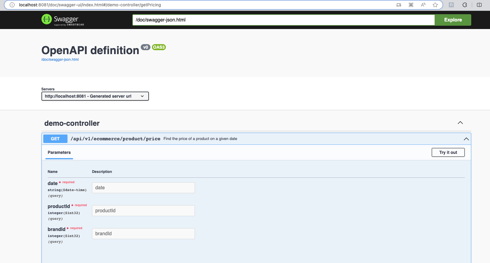
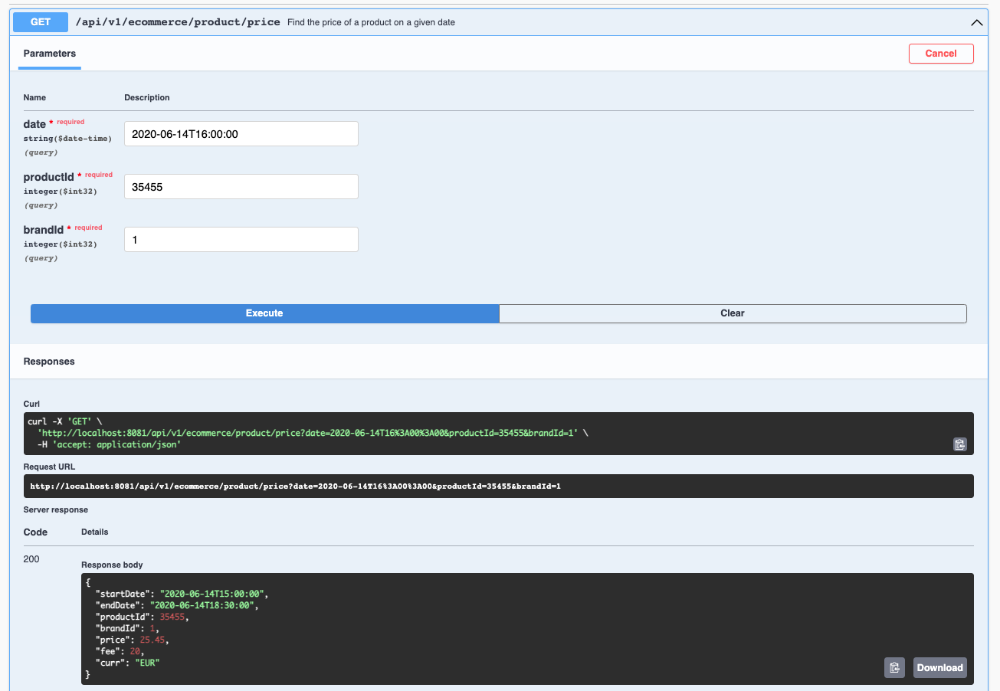

# API REST ecommerce
This project demonstrates the implementation of a API RESTfull  to query the prices of finished products stored in an h2 database.
## Features
* API REST
* DB H2
* Swagger (API REST contract)
* Unit test
* Integration test 
* Acceptance tests (Cucumber)

## Technologies:
```
• Spring Boot 3.1.4-SNAPSHOT
• Java 17
• Open API 3
• H2 Database
• Gradle
• Cucumber
```

## Getting Started
You will need to have the following installed on your local machine:
* JDK 17+
* Maven
* Gardle

To build and run the project, follow these steps:

* Clone the repository: `https://github.com/omar-napoleon/ecommerce`
* Navigate to the project directory: cd ecommerce

* Build the project: gradle build
* Option 1 (Run the project):
  ```shell
  gradle bootRun
  ```
* Option2 (Dockerfile):
```shell
  docker build -t ecommerce .
  docker run -p8081:8081 ecommerce
``` 
-> The application will be available at http://localhost:8081. 
-> Health: `http://localhost:8081/actuator/health`

## Swagger (Contract)
• http://localhost:8081/swagger-ui/index.html#/



• api-docs: [Ver contrato Swagger (JSON)](swagger.json)

### Get Product price
#### http://localhost:8081/api/v1/ecommerce/product/price?date=2020-06-14T16:00:00&productId=35455&brandId=1
```csharp
curl -X 'GET' \
'http://localhost:8081/api/v1/ecommerce/product/price?date=2020-06-14T16%3A00%3A00&productId=35455&brandId=1' \
-H 'accept: application/json'
```

